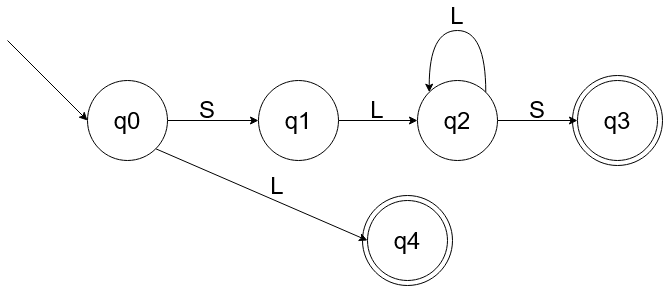

# Manual Técnico
## Descripción de la Aplicación 
*El proyecto consiste en la elaboración de una herramienta que permita el diseño y creación 
de sentencias de bases de datos no relacionales de una forma sencilla. La aplicación tendrá 
un área de edición de código y un área de visualización de la sentencia final generada.*

* ***Plataforma Utilizada:*** *Una característica importante para el uso de Visual Studio Code es que está 
disponible para Windows, GNU/Linux y macOS, también incluye la función de 
depuración que ayuda a detectar errores en el código. De esta manera, nos 
evitamos tener que revisar línea por línea para encontrar errores.*
* ***Librerías:***
    *  ***TKinter*** 
        1. Disponible sin cargo para uso comercial.
        2. Se presenta en la biblioteca Python subyacente.
        3. La creación de ejecutables para las aplicaciones de Tkinter es más accesible ya que Tkinter está incluido en Python, y, como consecuencia, no viene con ninguna otra dependencia 
        4. Simple de entender y dominar, ya que Tkinter es una librería limitada con una API simple, siendo la opción principal para crear interfaces gráficas de usuario rápidas para scripts Python.  
  
# Analizador Léxico
## Tabla de Tokens 
| Token         | Lexema        | Descripción  |
| ------------- | ------------- | -------------|
| CrearBD  | CrearBD  | Palabra Reservada |
| EliminarBD  | EliminarBD  | Palabra Reservada |
| CrearColeccion  | CrearColeccion  | Palabra Reservada |
| EliminarColeccion  | EliminarColeccion  | Palabra Reservada |
| InsertarUnico  | InsertarUnico  | Palabra Reservada |
| ActualizarUnico  | ActualizarUnico  | Palabra Reservada |
| EliminarUnico  | EliminarUnico  | Palabra Reservada |
| BuscarTodo  | BuscarTodo  | Palabra Reservada |
| BuscarUnico  | BuscarUnico  | Palabra Reservada |
| Parentecis_Abierto  | ( | Signo ( |
| Parentecis_Cerrado  | )  | Signo ) |
| PuntoYComa  | ;  | Signo ; |
| Igual  | =  | Signo = |
| Identificador | [a-z_A-Z_0-9]* | Expresion regular para nombre de variables |
| Atributos | "+[a-z_A-Z_0-9]+"| Expresion regular para nombre de atributos |

## Expresión Regular (S+L\*S+| L\*) 
*Donde:*
* *S = Símbolos [comillas, llaves, parentesis]*
* *Letras = L = [a-zA-Z]\* = L\**

## Diagrama de Árbol

## Tabla de Siguientes

## DFA

&nbsp;
# Analizador Sintactico
## Gramática Libre de Contexto
| &nbsp;         | &nbsp;        | 
| ------------- | ------------- | 
| init :  | instrucciones  |
| instruccion : | instruccion instrucciones |
||\| instruccion|
|&nbsp;|| |
|instruccion | crearBD ; |
||\| eliminarBD ;|
|| \| crearColeccion ; |
|| \| eliminarColeccion ; |
|| \| insertarUnico ; |
|| \| actualizarUnico ; |
|| \| eliminarUnico ; |
|| \| buscarTodo ; |
|| \| buscarUnico ; |
&nbsp;
#### *crearBD : CrearBD ID = nueva CrearBD( )*
#### *eliminarBD : EliminarBD ID = nueva EliminarBD( )*
#### *crearColeccion : CrearColeccion ID = nueva CrearColeccion( STRING )*
#### *eliminarColeccion : EliminarCOleccion ID = nueva EliminarColeccion( STRING )*
#### *insertarUnico : InsertarUnico ID = nueva InsertarUnico( STRING, STRING )*
#### *actualizarUnico : ActualizarUnico ID = nueva ActualizarUnico( STRING, STRING )*
#### *eliminarUnico : EliminarUnico ID = nueva EliminarUnico( STRING )*
#### *buscarTodo : BuscarTodo ID = nueva BuscarTodo( STRING )*
#### *buscarUnico : BuscarUnico ID = nueva BuscarUnico( STRING )*
