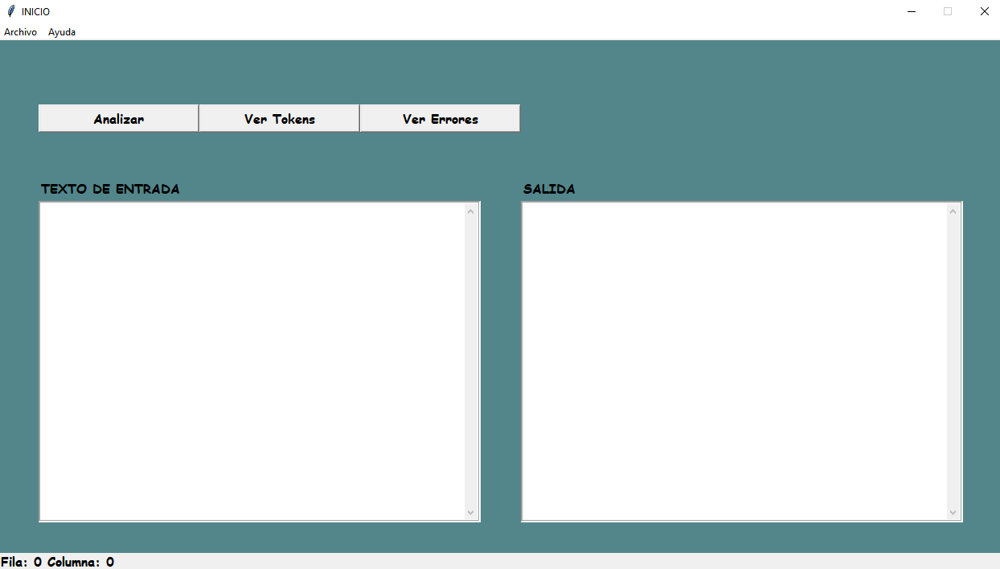

# MANUAL DE USUARIO
## COMPILTADOR DE SENTENCIA DE BASE DE DATOS NO RELACIONALES

## *Sobre la Aplicación*
*El proyecto consiste en la elaboración de una herramienta que permita el diseño y creación 
de sentencias de bases de datos no relacionales de una forma sencilla. Cuando ya se cuente con las sentencias creadas inicialmente, se procederá a realizar la compilación respectiva para generar las sentencias de MongoDB.*

## *Página de Inicio*
*En esta página se centraliza las diferentes opciones disponibles que poseen los distintos usuarios de la aplicación.*

* ***Opción Abrir:*** *Permite abrir un archivo para posteriormente analizarlo o
editarlo.*
* ***Opción Guardar:*** *Permite guardar los cambios realizados en el archivo.*
* ***Opción Guardar Como:*** *Esta opción permite guardar el archivo con un 
nombre diferente.*
* ***Opción Analizar:*** *Analiza el texto y mostrará los elementos reconocidos.*
* ***Opción Ver Token:*** *Muestra los tokens reconocidos del último archivo analizado.*
* ***Opción Ver Errores:*** *Muestra los errores del último archivo analizado.*
* ***Opción Ayuda:*** *Mostrara el manual de usuario y técnico de la aplicación.*
* ***Opción Salir:*** *Finaliza la ejecución de la aplicación.*

### *Sobre la opción Abrir*
*Al presionar la opción “Abrir” se mostrará una nueva ventana donde podrá abrir y cargar un nuevo archivo al sistema.*

### *Sobre la opción Analizar*
*Al presionar la opción Analizar se ejecutará un análisis y posteriormente se mostrar los resultados obtenidos en el área de texto correspondite*

### *Sobre la opción Ver Tokens*
*Mostrará una tabla en la cual estarán listados todos los tokens que se reconocierón en 
el archivo de entrada*

### *Sobre la opción Ver Errores*
*En el área de errores está conformada por una tabla y dentro de esta serán cargados tanto los 
errores léxicos como los errores sintácticos luego de compilado algún archivo.*

